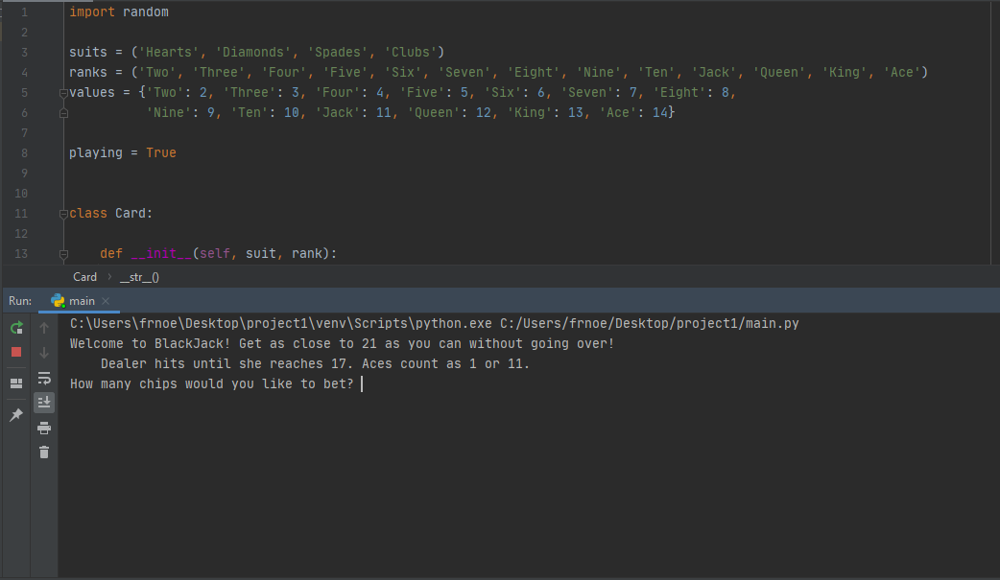

# BLACKJACK-GAME

Classic blackjack game programmed in python

## Preview



## Usage

You can get the game locally by cloning it and running it:

Clone the repository:
```
git clone git@github.com:byfnoel/blackjack-game
```

and
```
cd blackjack-game
```

then
```
python3 blackjack.py
```

## License

Licensed under either of

 * Apache License, Version 2.0
   ([LICENSE-APACHE](LICENSE-APACHE) or http://www.apache.org/licenses/LICENSE-2.0)
 * MIT license
   ([LICENSE-MIT](LICENSE-MIT) or http://opensource.org/licenses/MIT)

at your option.
